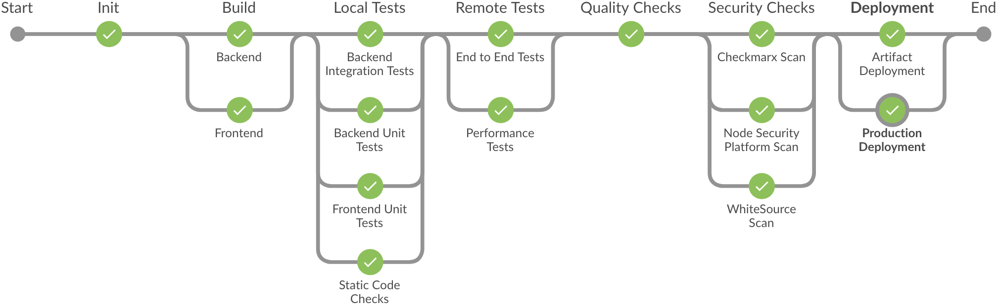

# SAP S/4HANA Cloud SDK Pipelines
 
 
 
 ## Description

 The [SAP S/4HANA Cloud SDK](https://sap.com/s4sdk) helps to develop S/4HANA extension application on the SAP Cloud Platform. 
 Continuous integration and delivery (CI/CD) is an important aspect of cloud application development.
 This repository contains a Jenkins pipeline as code designed for the requirements and structure of application written with this SDK. 
 It contains the steps for building, testing and deploying applications to the SAP Cloud Platform.
 
 ## Requirements
 
 To use the pipeline you need a Jenkins server which has the [pipeline library](https://github.com/SAP/cloud-s4-sdk-pipeline-lib) as shared library configured.
 The best way to achieve this is to use the SAP S/4HANA Cloud SDK Cx Server.
 
 For instantiating the SAP S/4HANA Cloud SDK Cx Server, you need to provide a suitable host with a linux operating system and Docker installed. Please also ensure that the user with whom you start the Cx Server belongs to the
 docker group.
 
 Your project source files need to be available on a git or github server, which is accessible from the Cx Server host.
 
 The lifecycle of the Cx Server is maintained by a script called `cx-server`.
 It can be found in the same named folder on the root of each SAP S/4HANA Cloud SDK project archetype. Together with the `server.cfg` file, this is all you need for starting your instance of the SAP S/4HANA Cloud SDK Cx Server.
 
 To create a new project using the SDK execute the following command:
 
 ```shell
  mvn archetype:generate -DarchetypeGroupId=com.sap.cloud.s4hana.archetypes -DarchetypeArtifactId=scp-cf-tomee -DarchetypeVersion=RELEASE
 ```
 
 In the new project there is a folder called `cx-server`.
 This folder needs to be copied to the future host on which the Cx Server is intended to run.
 
 On the host machine execute the following command in the folder `cx-server`.
 This will start the Jenkins server.
 ```shell
  ./cx-server start
 ```

 In Jenkins click on "New Item" and create a new "Multibranch Pipeline" for your repository.  
  
 ## Download and Installation
 
 In order to use the pipeline just load the pipeline within your Jenkinsfile that is placed in the root of your project repository. 
 Create a file called Jenkinsfile and add the following example code:
 
 ```groovy
 #!/usr/bin/env groovy 
 
 node {
     deleteDir()
     sh "git clone --depth 1 https://github.com/SAP/cloud-s4-sdk-pipeline.git pipelines"
     load './pipelines/s4sdk-pipeline.groovy'
 }
```

 After you commit your changes and the Jenkins server starts to build the project it will automatically use the pipeline. 

## Known Issues
 Currently, there are no known issues.

## How to obtain support
 If you need any support, have any question or have found a bug, please report it as issue in the repository.

## License
 Copyright (c) 2017-2018 SAP SE or an SAP affiliate company. All rights reserved.
 This file is licensed under the Apache Software License, v. 2 except as noted otherwise in the [LICENSE file](LICENSE).
